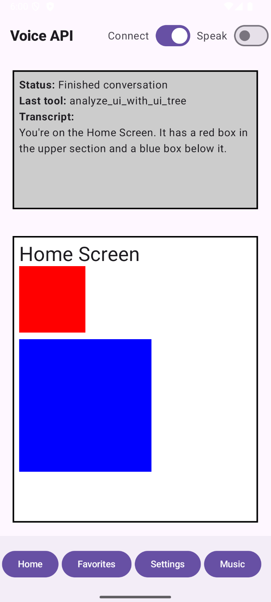
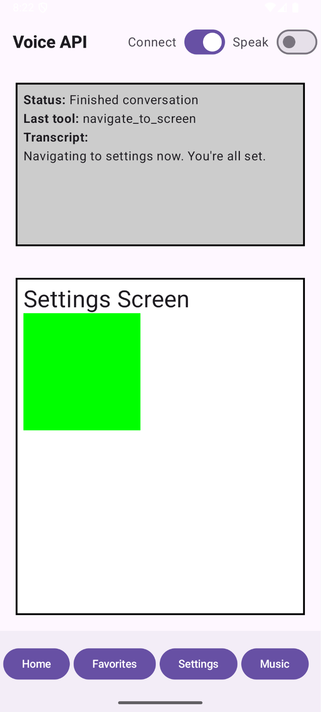

# GROK VOICE API TEST

This repository contains an example **Android application** that demonstrates the easy integration
of the **[Grok Voice Agent API](https://docs.x.ai/docs/guides/voice/agent)** using plain websocket communication.  No text-to-speech or
speech-to-text lib is needed, as the Grok Voice Agent API uses base64 encoded voice data directly.

## Use cases

The app uses **custom tools configuration** to let the voice model call Android functions for two use-cases:

- Use voice command for navigation between the different app screens (NavGraph).
  ```
  Navigate to the "settings" screen.
  ```
  
- Use voice command to analyze the content of the current screen.
  ```
  Analyze the screen.
  ```

## Demo Video

https://github.com/user-attachments/assets/2b04e8b2-741a-4d42-92be-8fd016355cdc

## App Screenshots

| Analyze Screen Command                   | Navigation Command                       |
|------------------------------------------|------------------------------------------|
|  |  |

## Installation

1. Add an environment variable XAI_API_KEY with your [Grok API key](https://console.x.ai/).
2. Open the project in Android Studio.
3. Start Android Emulator with enabled microphone and install the app.
4. Toggle "Connect" button to start the Grok Voice Agent session.
5. Toggle "Speak" button and start speaking.
